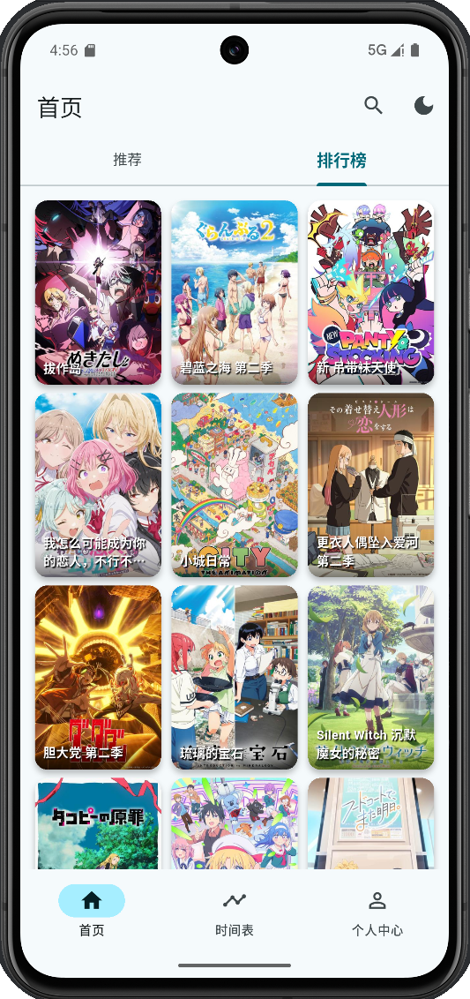
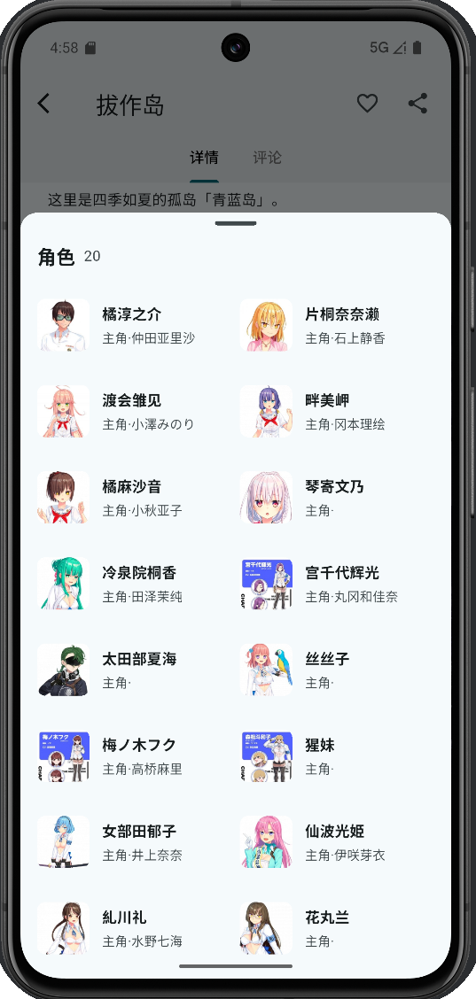
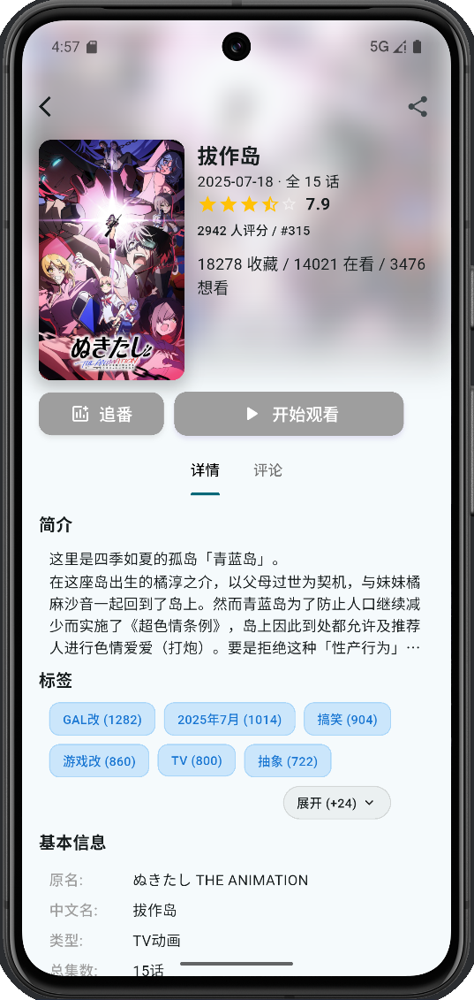
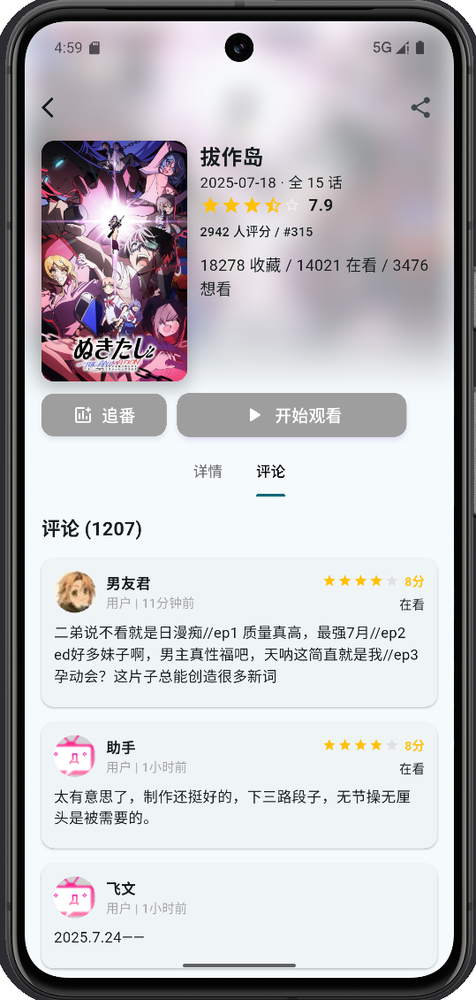

# AnimeFlow

<div align="center">


**结合 "Anime"（动漫）和 "Flow"（流动感），**

[](https://flutter.dev/)
[](https://dart.dev/)
[](LICENSE)

</div>

## 📱 项目简介

AnimeFlow 是一款基于 Flutter 开发的现代化动漫播放器，专注于为用户提供流畅、美观的动漫观看体验。应用采用 Material Design 3 设计规范，支持深色/浅色主题切换，界面简洁美观。

## ✨ 主要功能

### 🏠 首页
- **热门推荐**：展示热门动漫作品
- **最新更新**：实时获取最新动漫信息
- **个性化推荐**：基于用户喜好的智能推荐

### 📅 时间表
- **每日放送**：查看每日更新的动漫
- **周历视图**：按星期分类的动漫列表
- **实时更新**：自动获取最新放送信息

### 🔍 搜索功能
- **智能搜索**：支持动漫名称、角色名搜索
- **搜索历史**：记录用户搜索历史
- **搜索建议**：智能搜索建议

### 👤 个人中心
- **Bangumi 授权登录**：支持 Bangumi 账号登录
- **用户信息展示**：显示用户头像、昵称、签名
- **观看统计**：展示用户的观看数据统计
- **主题切换**：支持深色/浅色主题

### 🎬 播放器
- **流畅播放**：支持多种视频格式播放
- **弹幕支持**：(开发中...)
- **播放控制**：播放、暂停、进度控制

### 💬 评论系统
- **实时评论**：查看和发表评论(发送评论开发中...)
- **评论互动**：(开发中...)

## 🖼️ 应用截图

<div align="center">

### 搜索功能
<div style="display: flex; justify-content: center; gap: 20px; flex-wrap: wrap;">
  
  
</div>

### 排行榜
<div style="display: flex; justify-content: center;">
  
</div>

### 个人中心
<div style="display: flex; justify-content: center;">
  
</div>

### 详情页面
<div style="display: flex; justify-content: center;">
  
</div>

### 评论系统
<div style="display: flex; justify-content: center;">
  
</div>

### 时间表
<div style="display: flex; justify-content: center;">
  
</div>

</div>

## 🛠️ 技术栈

- **前端框架**：[Flutter](https://flutter.dev/) - Google 的 UI 框架
- **编程语言**：[Dart](https://dart.dev/) - 面向对象的编程语言
- **状态管理**：Provider - 轻量级状态管理
- **网络请求**：HTTP 客户端
- **数据存储**：SharedPreferences - 本地数据存储
- **UI 设计**：Material Design 3


## 🚀 快速开始


### 安装步骤

1. **克隆项目**
   ```bash
   git clone https://github.com/LiggMax/Flutter-Anime.git
   cd AnimeFlow
   ```

2. **安装依赖**
   ```bash
   flutter pub get
   ```

3. **运行项目**
   ```bash
   flutter run
   ```

### 构建发布版本

**Android APK**
```bash
flutter build apk --release
```

**iOS**
```bash
flutter build ios --release
```

**Windows**
```bash
flutter build windows --release
```
**Macos**
```bash
flutter build macos --release
```


## 🙏 致谢

- [Bangumi](https://bangumi.tv/) - 提供动漫数据 API
- [Flutter](https://flutter.dev/) - 优秀的跨平台框架
- [Material Design](https://material.io/) - 设计规范

## 📞 联系我们

- 项目主页：[GitHub](https://github.com/LiggMax/Flutter-Anime.git)
- 问题反馈：[Issues](https://github.com/LiggMax/AnimeFlow/issues)

---

<div align="center">

**如果这个项目对你有帮助，请给它一个 ⭐️**

</div>
